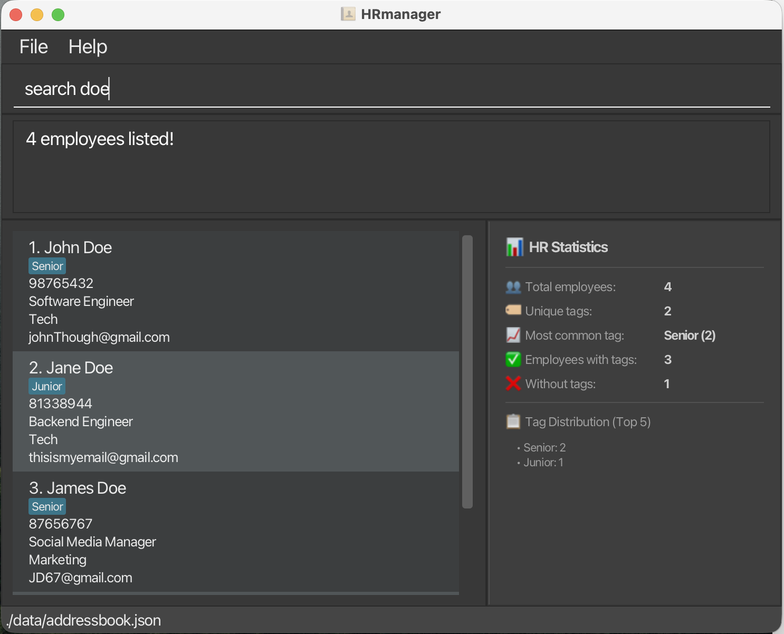
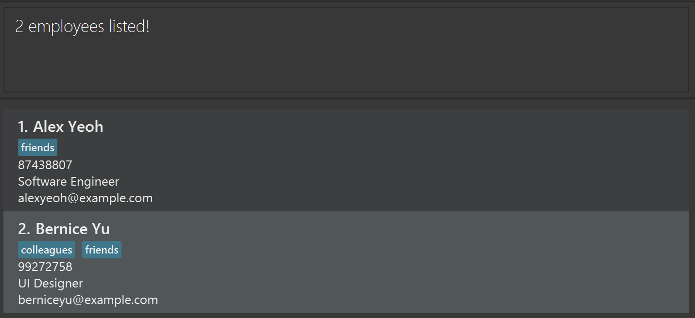
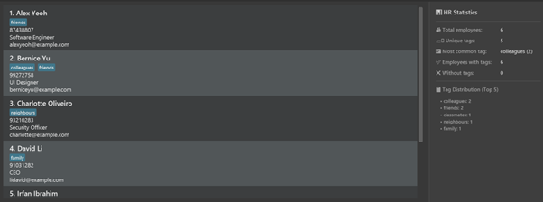

# HRmanager User Guide

HRmanager is a **desktop app for managing employee and applicant records, optimized for use via a Line Interface** (CLI) while still having the benefits of a Graphical User Interface (GUI). If you can type fast, HRmanager can help you manage HR records faster than traditional GUI apps.

<!-- * Table of Contents -->
<page-nav-print />

--------------------------------------------------------------------------------------------------------------------

## Quick start

1. Ensure you have Java `17` or above installed in your Computer. 
   **Mac users:** Ensure you have the precise JDK version prescribed [here](https://se-education.org/guides/tutorials/javaInstallationMac.html).

1. Download the latest `.jar` file from [the HRmanager releases page](https://github.com/AY2526S2-CS2103T-T13-1/tp/releases).

1. Copy the file to the folder you want to use as the _home folder_ for HRmanager.

1. Open a command terminal, `cd` into the folder you put the jar file in, and use the `java -jar HRmanager.jar` command to run the application. 
   A GUI similar to the below should appear in a few seconds. Note how the app contains some sample data. 
   

1. Type the command in the command box and press Enter to execute it. e.g. typing **`help`** and pressing Enter will open the help window. 
   Some example commands you can try:

  * `list` : Lists all employees currently shown in HRmanager.

  * `add n/John Doe p/98765432 e/johnd@example.com r/Software Engineer` : Adds an employee named `John Doe` to HRmanager.

  * `delete 3` : Deletes the 3rd employee shown in the current list.

  * `clear` : Deletes all employees.

  * `exit` : Exits the app.

1. Refer to the [Features](#features) below for details of each command.

--------------------------------------------------------------------------------------------------------------------

## Features

<box type="info" seamless>

**Notes about the command format:** 

* Words in `UPPER_CASE` are the parameters to be supplied by the user. 
  e.g. in `add n/NAME`, `NAME` is a parameter which can be used as `add n/John Doe`.

* Items in square brackets are optional. 
  e.g `n/NAME [t/TAG]` can be used as `n/John Doe t/friend` or as `n/John Doe`.

* Items with `…`​ after them can be used multiple times including zero times. 
  e.g. `[t/TAG]…​` can be used as ` ` (i.e. 0 times), `t/friend`, `t/friend t/family` etc.

* Parameters can be in any order. 
  e.g. if the command specifies `n/NAME p/PHONE_NUMBER`, `p/PHONE_NUMBER n/NAME` is also acceptable.

* Extraneous parameters for commands that do not take in parameters (such as `help`, `list`, `exit` and `clear`) will be ignored. 
  e.g. if the command specifies `help 123`, it will be interpreted as `help`.

* Name constraints: Names should only consist of letters from the alphabet, hyphens ("-") or spaces, and should be between 2 and 50 characters long. The name should not start or end with a space or hyphen, and it should not contain consecutive spaces or hyphens. Upper or lowercase letters does not matter.

* Phone Number constraints: The phone number must contain only numbers, and be between 3 and 16 digits inclusive. Do not include spaces, extensions or country codes.

* Tag constraints: Tags must be **alphanumeric** (only letters and numbers) and **between 1 to 50 characters long**. Tags are **case-sensitive**. 
  e.g. `t/HR`, `t/Department123` are valid; `t/HR Department` (contains space), `t/HR!`(contains special character), and tags longer than 50 characters are invalid.

* If you are using a PDF version of this document, be careful when copying and pasting commands that span multiple lines as space characters surrounding line-breaks may be omitted when copied over to the application.
</box>

### Viewing help : `help`

Shows a message explaining how to access the help page.

Format: `help`

### Cycle through previous executed commands

You can pre-fill the command box with your last successful command using the **PgUp (up arrow) key** on computer keyboards. This allows users to repeat their last commands without re-typing it in its entirety.

* Use the PgUp (Up arrow) key to move towards older commands, PgDn (Down arrow) key to move towards latest commands.
* Only successful past commands are saved.
* Up to 5 past commands are saved. Thereafter, the oldest command is deleted to accomodate a new one.
* The current pending command is saved when the command history is explored.
* The latest command will not be saved if exactly same as the previous consecutive one.

### Adding an employee: `add`

Adds an employee to HRmanager.

Format: `add n/NAME p/PHONE_NUMBER e/EMAIL a/ADDRESS [t/TAG]…​`

<box type="tip" seamless>

**Tip:** An employee can have any number of tags (including 0)
</box>

Examples:
* `add n/John Doe p/98765432 e/johnd@example.com r/Receptionist`

* `add n/Betsy Crowe t/friend e/betsycrowe@example.com r/Associate Director p/1234567 t/criminal`

### Listing all employees : `list`

Shows a list of all employees in HRmanager.

Format: `list`

### Editing an employee : `edit`

Edits an existing employee in HRmanager.

Format: `edit INDEX [n/NAME] [p/PHONE] [e/EMAIL] [r/ROLE] [t/TAG]…​`

* Edits the employee at the specified `INDEX`. The index refers to the index number shown in the displayed employee list. The index **must be a positive integer** 1, 2, 3, …​
* At least one of the optional fields must be provided.
* Each optional field accepts at most 1 updated value, i.e. no duplicate fields.
* Existing values will be updated to the input values.
* When editing tags, the existing tags of the employee will be removed i.e. adding of tags is not cumulative.
* You can remove all the employee's tags by typing `t/` without
    specifying any tags after it.

Examples:
*  `edit 1 p/91234567 e/johndoe@example.com` edits the phone number and email address of the 1st employee to be `91234567` and `johndoe@example.com` respectively.
*  `edit 2 n/Betsy Crower t/` edits the name of the 2nd employee to be `Betsy Crower` and clears all existing tags.

### Searching employees by name: `search`

Finds employees whose names contain any of the given keywords.

Format: `search KEYWORD [MORE_KEYWORDS]...`

* The search is case-insensitive. e.g `hans` will match `Hans`
* Only one keyword allowed i.e. spaces are invalid.
* Every field is searched (name, phone, email, role, tag(s) if any).
* Partial matches are supported. e.g. `Han` will match `Hans`
* The keyword must be at most `50` characters long.
* A blank search is invalid and HRmanager will show the command usage message.

Examples:
* `search John` returns `john` and `John Doe`
* `search friends` returns employees such as `Alex Yeoh` and `Bernice Yu` with the tag "friends".  
  
* `search zzz` shows `0 employees listed!` if no employee names match.

### Deleting an employee : `delete`

Deletes one or more employees from the list using their displayed index numbers.

Format: `delete INDEX [MORE_INDEXES]`

* Deletes the employee(s) at the specified `INDEX`.
* The index refers to the index number shown in the displayed employee list.
* The index **must be a positive integer** 1, 2, 3, …​
* Multiple indexes can be provided to delete multiple employees in one command.

Examples:
* `list` followed by `delete 2` deletes the 2nd employee in HRmanager.
* `search Betsy` followed by `delete 1` deletes the 1st employee in the results of the `search` command.
* `delete 1 3 5` deletes the 1st, 3rd, and 5th employees in the displayed list.

### Clearing all entries : `clear`

Clears all entries from HRmanager.

Format: `clear`

### Exiting the program : `exit`

Exits the program.

Format: `exit`

### Viewing statistics: `stats`

Displays real-time statistics about your employee records in a dedicated panel on the right side of the application.

The statistics panel automatically updates as you add, edit, or delete employees, providing instant visibility into your workforce metrics.

**Statistics displayed:**
- 👥 **Total employees**: Total number of employee records
- 🏷️ **Unique tags**: Number of distinct tags used across all employees
- 📈 **Most common tag**: The tag that appears most frequently (with count)
- ✅ **Employees with tags**: Number of employees that have at least one tag
- ❌ **Employees without tags**: Number of employees with no tags
- 📋 **Tag distribution**: Top 5 most frequently used tags

<box type="tip" seamless>

**Tip:** The stats panel is always visible and updates in real-time when you add, edit, or delete employees. No command is needed to view statistics!
</box>

Format: No command needed - statistics panel is always displayed.

### Saving the data

HRmanager data are saved in the hard disk automatically after any command that changes the data. There is no need to save manually.

### Editing the data file

HRmanager data are saved automatically as a JSON file `[JAR file location]/data/HRmanager.json`. Advanced users are welcome to update data directly by editing that data file.

<box type="warning" seamless>

**Caution:**
If your changes to the data file make its format invalid, HRmanager will discard all data and start with an empty data file at the next run. Hence, it is recommended to take a backup of the file before editing it. 
Furthermore, certain edits can cause HRmanager to behave in unexpected ways (e.g., if a value entered is outside the acceptable range). Therefore, edit the data file only if you are confident that you can update it correctly.
</box>

### Archiving data files `[coming in v2.0]`

_Details coming soon ..._

--------------------------------------------------------------------------------------------------------------------

## FAQ

**Q**: How do I transfer my data to another Computer? 
**A**: Install the app on the other computer and overwrite the empty data file it creates with the file that contains the data from your previous HRmanager home folder.

--------------------------------------------------------------------------------------------------------------------

## Known issues

1. **When using multiple screens**, if you move the application to a secondary screen, and later switch to using only the primary screen, the GUI will open off-screen. The remedy is to delete the `preferences.json` file created by the application before running the application again.
2. **If you minimize the Help Window** and then run the `help` command (or use the `Help` menu, or the keyboard shortcut `F1`) again, the original Help Window will remain minimized, and no new Help Window will appear. The remedy is to manually restore the minimized Help Window.

--------------------------------------------------------------------------------------------------------------------

## Command summary

Action     | Format, Examples
-----------|----------------------------------------------------------------------------------------------------------------------------------------------------------------------
**Add**    | `add n/NAME p/PHONE_NUMBER e/EMAIL r/ROLE [t/TAG]…​`   e.g., `add n/James Ho p/22224444 e/jamesho@example.com r/Software Engineer t/friend t/colleague`
**Clear**  | `clear`
**Delete** | `delete INDEX`  e.g., `delete 3`
**Edit**   | `edit INDEX [n/NAME] [p/PHONE_NUMBER] [e/EMAIL] [r/ROLE] [t/TAG]…​`  e.g.,`edit 2 n/James Lee e/jameslee@example.com`
**Search** | `search KEYWORD...`  e.g., `search James`
**List**   | `list`
**Help**   | `help`
